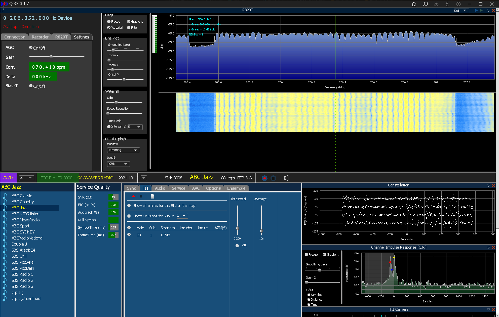

# How to run QIRX on macOS using Crossover

QIRX (https://qirx.softsyst.com/) is a great SDR client that has been developed to run in its most full-featured form under Windows. Using Crossover, it's possible to run the full version of QIRX on macOS and presumably Linux. 

CrossOver (https://www.codeweavers.com/crossover) is a commercial version of Wine (https://github.com/wine-mirror/wine) with some additional UI features. Theoretically this should also work in the free version of Wine. 

_Figure 0 - QIRX running on a Mac mini (2018) with 3.2GHz 6-Core Intel Core i7_

This configuration has been tested on a Mac mini (2018) with the lowest configuration, a 3.6Ghz Quad-Core Intel Core i3, as well as a Mac mini (2018) with a 3.2GHz 6-Core Intel Core i7 and a Macbook Air (M1, 2020) with an Apple M1 (a.k.a. "Apple Silicon" or "ARM64" architecture). It has also been tested on macOS Big Sur 11.6 and macOS Monterey 12.0.1. All configurations work with the same small issues which are documented below. 

## Prerequisites

These instructions assume that you have already configured a device as an rtl-tcp server. They also assume that you have installed CrossOver on your macOS device and have downloaded the QIRX Setup MSI file from https://qirx.softsyst.com/

## Step 1 - Load Crossover to the Installation Screen 
Click on Install a Windows Application

## Step 2 - Type in the name of the application to install
Type in QIRX and select it as an Unlisted application

## Step 3 - Click on Choose Installer File...

## Step 4 - Navigate to the QIRX Setup MSI file
In this example, the file is on the Desktop and we are installing QIRX version 3.1.7 using the file QIRX317_Setup.msi

## Step 5 - Click Continue
Once selected you will see the msi file and you can click Continue

## Step 6 - Select the New Windows 10 64-bit Bottle...
Although it may work with other bottle configurations, the best is to select a new Windows 10 64-bit Bottle

## Step 7 - Confirm all your settings and click Install

## Step 8 - Installation begins
If you are running some anti-virus software, it may complain about some of the files in the bottle. This is a known issue, the files are not malicious. Not all anti-virus software will do this. Refer: https://www.codeweavers.com/support/wiki/mac/mactutorial/bitdefender

## Step 9 - Click Next> at the first Wizard

## Step 10 - Read and agree the License Agreement
Click Next >

## Step 11 - Accept the default installation folder
Click Next >

## Step 12 - Create Desktop Icon
Click Next >

## Step 13 - Confirm Installation
Click Next >

## Step 14 - The Wizard should show successful completion
Click Close >

## Step 15 - The CrossOver Software Installer should show completion of QIRX
Click Done 

## Step 16 - The First Little Problem!
Crossover will install the software, but the icon will not be visible in the CrossOver screen.

## Step 17 - Double-Click on Run Command
You will need to run the `qirx.exe` application which (if you have the default configuration of CrossOver) can be found at `/Users/<youruser>/Library/Application Support/CrossOver/Bottles/QIRX/drive_c/Program Files/softsyst/QIRX3/qirx.exe` - Make sure to replace <youruser> with your actual username. Enter this path into the Command box and click on "Save Command as a Launcher" then Run. If you forget to click on "Save Command as a Launcher" you will have to repeat this process if you want a QIRX icon in CrossOver.

  
## Step 18 - Create the default config file
The first time you run `qirx.exe` you will be prompted to create a default config file. Click Yes.

## Step 19 - It Works!
You will next see QIRX start up, but with just the default empty configuration

## Step 20 - The Second Little Problem!
Click on the Gear at the top of the menu which will open up the Settings screen. For some reason this screen doesn't render properly and you can either end up with a completely black menu, a flashing menu or a menu missing the OK button. If it works, GREAT, if not, continue to Step 25 to edit the config file manually. In my case, I entered the information for my rtl-sdr server in row 1. What you cannot see is that some of those columns are meant to have titles, the one to the left of Autostop is Autostart. I have them both disabled. The first checkbox after RTL-SDR determines whether that radio is enabled or not. For simplicity, enter the IP address and Port of your rtl-sdr server where I have done so and click OK. You will also get that QIRX Configuration notice, just click OK.

  
## Step 21 - Writing the Configuration file
If you were successful with Step 20, you will see the following screen. Click OK. If not, continue on and we will edit the config file manually.

  
## Step 22 - Exit out of QIRX from step 21
You should see the icon in the CrossOver window. If not, you forgot to click on "Save Command as a Launcher" in step 17.

  
## Step 23 - Manually Edit the Config File - Part 1
If you click on the bottles icon on the top left of the CrossOver screen you will see a side window. You can then click on QIRX and it will give you several options.

  
## Step 24 - Manually Edit the Config File - Part 2
Right-click on QIRX and you can select "Open C: Drive" which will open the fake C: Drive that is part of the "bottle" 

  
## Step 25 - Manually Edit the Config File - Part 3
When you click "Open C: Drive" you will be taken to the full hierarchy of fake windows folders that tricks QIRX into thinking it's on a Windows machine. Navigate to `/Users/<youruser>/Library/Application Support/CrossOver/Bottles/QIRX/drive_c/users/crossover/Local Settings/Application Data/qirx3/qirx3.config` and edit that file. Here you can manually set all of the items that were potentially blocked on Step 20. Once everything is configured to match your configuration, you can go back to the CrossOver window. Double click on the QIRX icon as seen in Step 22.

## Step 26 - Reload QIRX
Depending on how you manually edited the config file in Step 25 your screen may or may not look exactly like below. 

## Step 27 - Select the band
You can select the band and encoding scheme on the top right. For the sake of these instructions, we will select DAB. Then click on the BLUE triangle next to DAB.

## Step 28 - Start your rtl-tcp server.
You will be prompted to start your rtl-tcp server. This step sometimes doesn't work. If not, simply exit CrossOver and reload it to get back to this step. In the cases where it doesn't work, it always seems to work on the 2nd try.

## Step 29 - This error always seems to happen!
You will see this failure, but I've always been able to safely ignore it. Click OK.

  
## Step 30 - This error is also normal (fix it by installing the database starting in Step 32)
Click past this error message

 
## Step 31 - Enjoy the music!
If you have DAB reception in your area, you should be able to see the channels available by selecting the right ensemble (in my case 9C, which you can select next to the purple DAB+ box). In these instructions I've used the fairly anemic low end Mac Mini (Core i3) and it works great. The updating of the graphics can be a bit slow on this i3 and if you have a better screen you can expand everything so it looks nicer. The Macbook Air M1 that I tried this on ran it much better and had a more responsive set of graphics.

 
## Step 32 - Fix the database error in DAB mode - Part 1
If you will be using DAB mode, you should install the database component which involves a few more steps. You will need to download QIRX_Database.zip from the QIRX web site, unzip it and then copy the unzipped folder to `/Users/<youruser>/Library/Application Support/CrossOver/Bottles/QIRX/drive_c/users/crossover/Desktop` (refer to steps 24/25 to get to this folder if you can't remember). 

## Step 33 - Fix the database error in DAB mode - Part 2
Go back to the CrossOver screen and Run Command (just like in Step 17)

## Step 34 - Fix the database error in DAB mode - Part 3
Select `/Users/<youruser>/Library/Application Support/CrossOver/Bottles/QIRX/drive_c/users/crossover/Desktop/install.bat` to run. This should run quickly with no other visible interaction. The next time you load QIRX you won't get the error you saw in Step 30

That should be it! Now you can enjoy QIRX on your Mac!
